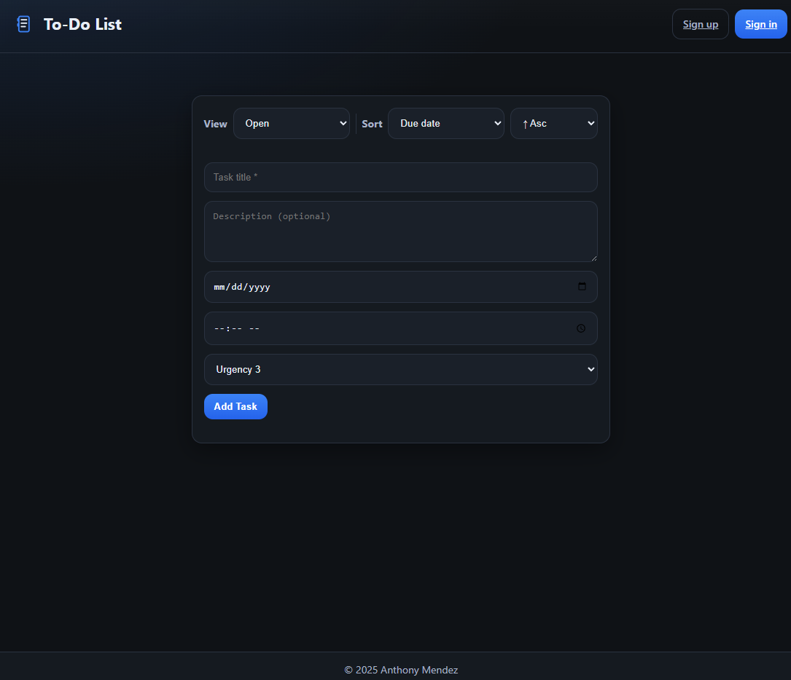
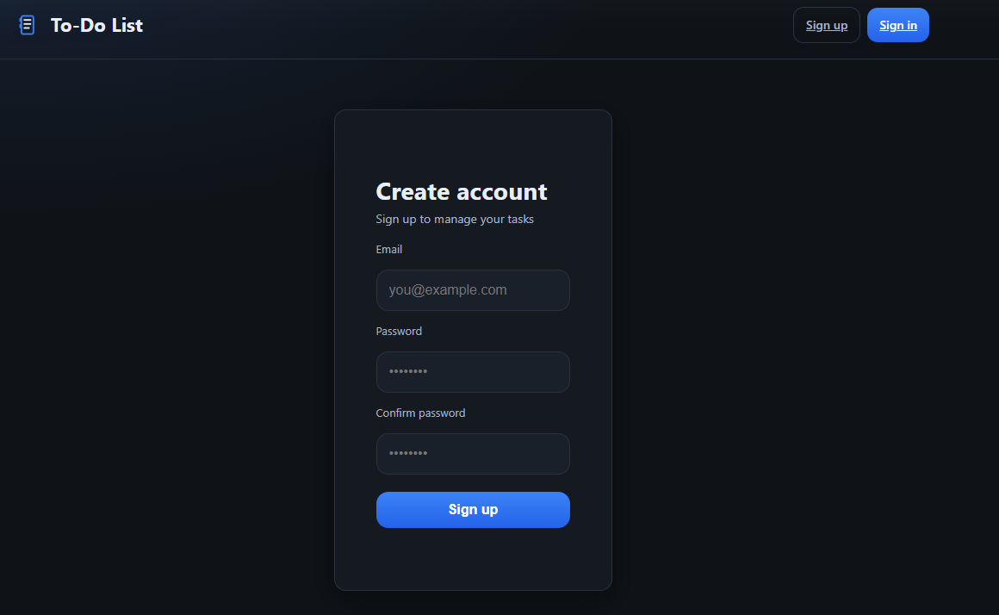
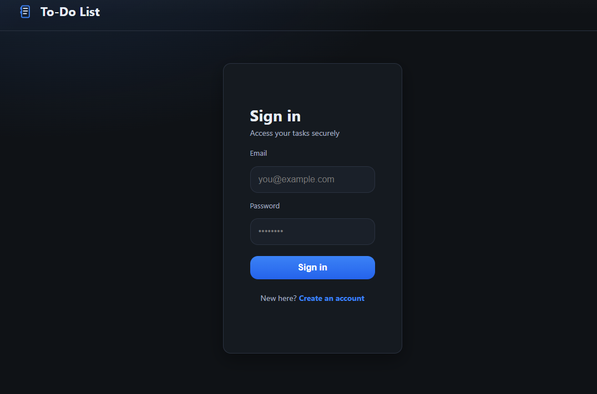
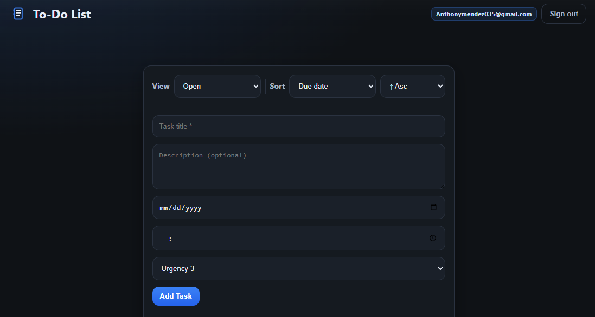
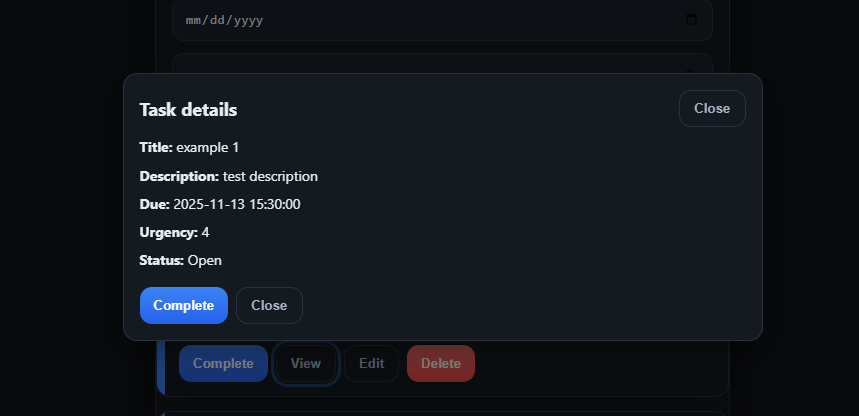
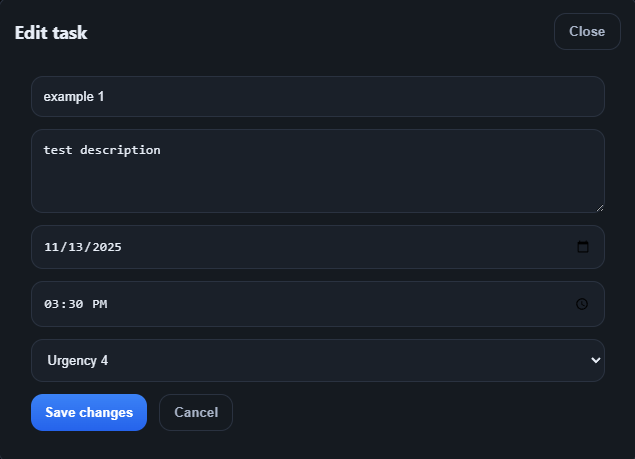
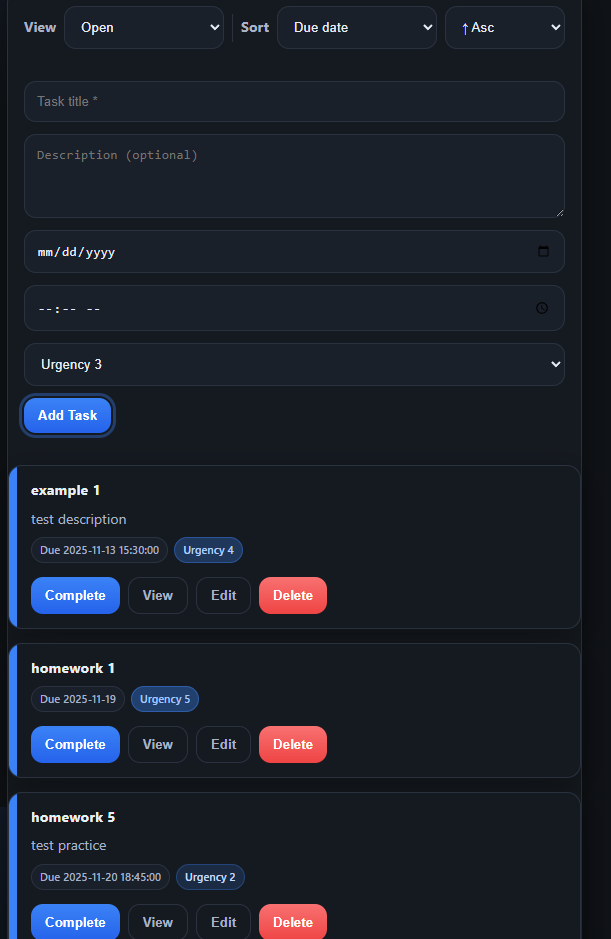

# To-Do App

A modern, dark-themed task manager with secure sign-in, due dates/times, urgency, filtering, and sorting.

**Live site:** https://d1p7pk2h9bas4v.cloudfront.net

---

## ✨ Features

- **Auth:** Sign up / Sign in with JWT (ASP.NET Identity)
- **Tasks:** Create, update, delete
- **Details:** Title, description, **due date**, optional **due time**, **urgency (1–5)**
- **Views:** Sort (due date, urgency, newest), filter (status/urgency), search by title
- **UI:** Responsive, dark charcoal theme with blue accents; card layout
- **API:** RESTful JSON with Swagger docs
- **Ops:** `/health` probe, optional `/dbping` connectivity check, CORS configured for CloudFront

---

## 🧱 Tech Stack

**Frontend**
- React (Vite), Axios, modern CSS (custom properties)

**Backend**
- C# / ASP.NET Core Web API
- Entity Framework Core + ASP.NET Identity (JWT)

**Database**
- SQL Server (Amazon RDS)

**Infra / Deploy**
- Frontend: S3 + CloudFront  
- Backend: AWS App Runner (Docker image in ECR)  
- Networking: VPC connector, Security Groups  
- Observability: CloudWatch logs

---

## 📸 Screenshots

<!-- Home -->

<em>Home — task grid with cards, dark UI</em>
  

<!-- Sign Up -->

<em>Sign Up — create an account</em>
  

<!-- Sign In -->

<em>Sign In — secure login</em>
  

<!-- Create Task -->

<em>Create Task — title, description, due date/time, urgency</em>
  

<!-- View Task -->

<em>View Task — details and metadata</em>
  

<!-- Edit Task -->

<em>Edit Task — update fields and save</em>
  

<!-- Tasks (list) -->

<em>Tasks — list view with sorting and filtering</em>
  

